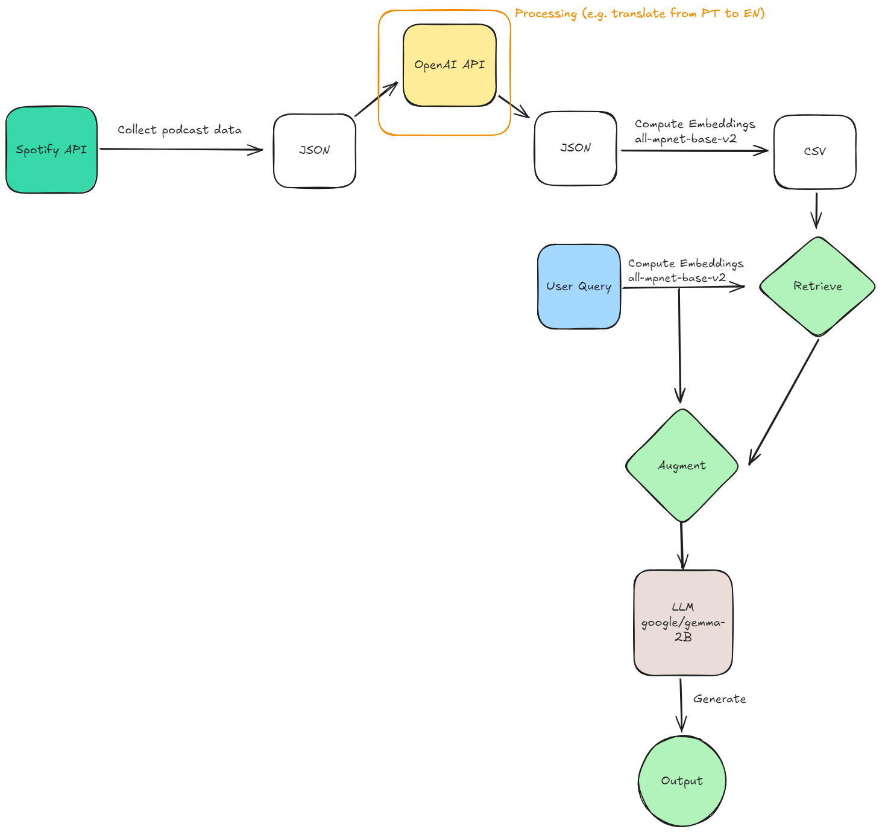

## Description
A brief overview of your project. Explain the purpose, the problem it solves, or its main features.

## Table of Contents
- [Installation](#installation)
- [Usage](#usage)
- [Features](#features)
- [Contributing](#contributing)
- [License](#license)

## Installation
Follow these steps to set up the project locally.

1. **Clone the repository**:
    ```bash
    git clone https://github.com/your-username/project-name.git
    cd project-name
    ```

2. **Create a virtual environment** (optional but recommended):
    ```bash
    python -m venv venv
    source venv/bin/activate # On Windows: venv\Scripts\activate
    ```

3. **Install dependencies** from `requirements.txt`:
    ```bash
    pip install -r requirements.txt
    ```

4. **Additional setup** (if any):
    - Mention any database setup, environment variables, etc.

